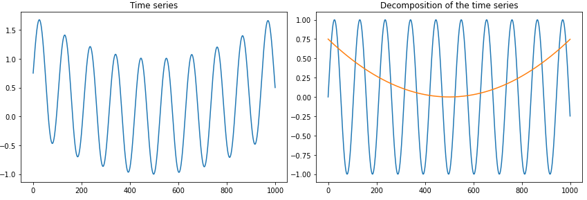

# ML-Statistics-Examples

Versions:
```
 Python (3.6.8)
 tsfresh (0.12.0)
 pandas (0.23.4)
```

Files:

- Phoneme.ipynb: Classification of time series. Neuronal nets and random forests applied to the time and frequency domain respectively.

- Clouds_sentinel.ipynb: Data from the Sentinel-2 satellite. Comparison of the amount of clouds between two regions.

  &nbsp;   &nbsp;  &nbsp;&nbsp;  &nbsp;   &nbsp;
  
   &nbsp;   &nbsp;  &nbsp;&nbsp;  &nbsp;   &nbsp;

- SSA.ipynb: Decomposition of a time series by the singular spectrum analysis.

   &nbsp;   &nbsp;  &nbsp;&nbsp;  &nbsp;   &nbsp;

- price_plots_and_log_return_distributions.ipynb: Some plots of a price time series and analysis of the distribution of the logarithmic returns ("log returns"). 
    
 Example of cryptocurrency prices (01 2019 - 05 2019): The power transformed positive (or negative) log returns follow a genlogistic distribution.


- feature_selection_example.ipynb: Feature selection of a time series (via the package tsfresh) and forecast models. 
